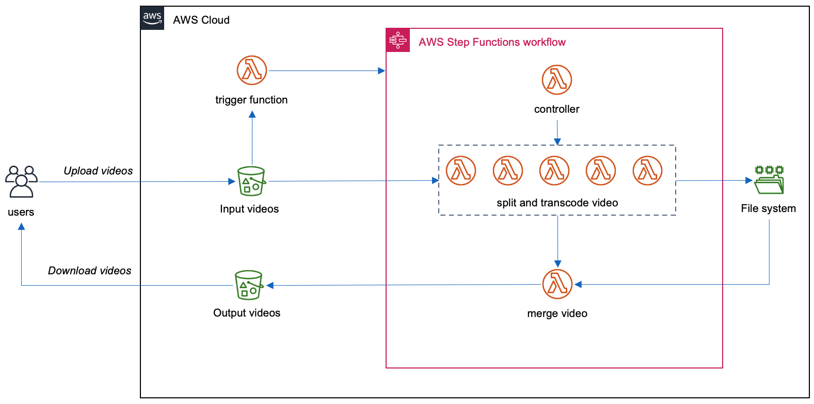

# serverless-video-transcoding

Serverless视频转码：通过Step Functions, Lambda和EFS实现分布式视频转码。适用于按需快速视频转码。Serverless架构，无需管理计算集群。 

## 测试结果

1. 1小时 1080p mp4 (h264, aac) 转码为720p mp4（h264, aac): 3分50秒
2. 8分钟 1080p mp4 (h264, aac) 转码为720p mp4 (h264, aac): 1分10秒
3. 8分钟 2160p mp4 (h264, aac) 转码为720p mp4 (h264, aac): 2分23秒

## 部署方式
目前有两种部署方式：快速部署和手工部署。

### 快速部署

使用Quickstart/templates目录下的CloudFormation模版，可以快速完成部署。这个模版会新建带有两个公有子网的VPC, S3和DynamoDB Endpoints, S3存储桶，DyanomDB表，Lambda函数和Step Functions状态机。

|           Region            |                     Launch Stack in VPC                      | 
| :-------------------------: | :----------------------------------------------------------: | 
| **北京** (cn-north-1)   |  | 
| **宁夏** (cn-northwest-1) |  | 

### 手工部署
1. 使用现有vpc，选择两个子网，记录子网ID，也可以新建VPC。子网需要能够访问S3和DynamoDB。建议通过S3,DynamoDB endpoint。
2. 在VPC中新建EFS file system和accesspoint，设置POSIX user和Root directory creation permissions。记录file system ID和access point ID，在第4步中使用。
3. sam build
4. sam deploy --guided 输入对应的参数

## 使用方法

部署完成后，在视频S3桶中input/目录下上传mp4文件。系统自动触发lambda函数和Step Funcntions进行转码，输出文件在同一S3桶的output目录下。

