# 无服务器转码动手实验

通过这次实验，您将部署serverless-video-transcoder，运行多个测试，实际体验无服务器转码的便捷和速度。


## 实验环境

实验需要使用AWS账号和管理员用户。 您可以使用自己的AWS账号，或是使用AWS提供的实验账号。

### Cloud9实例

在AWS Console中选择“俄勒冈州”区域，在服务菜单中选择“Cloud9”。
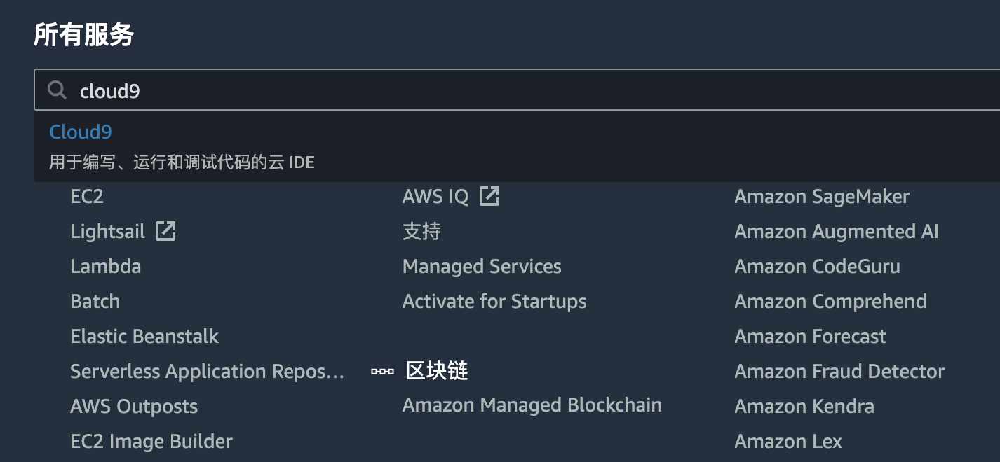
在Cloud9 Console中选择“Create environment”, 输入name，例如“workshop"，点击“Next Step”。
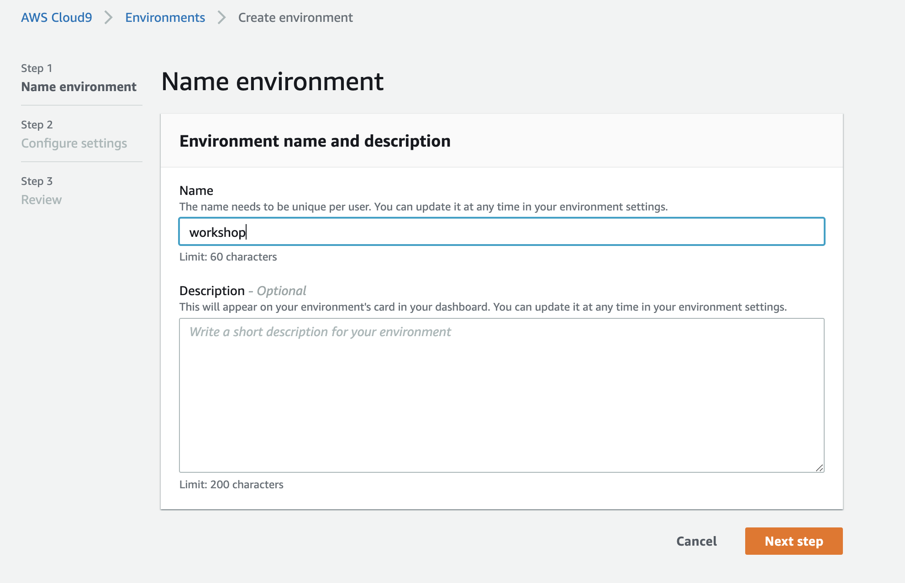

在configuration页面，instance type选择m5.large, Platform选择Amazon Linux 2, 点击“Next Step”


确认参数设置正确，点击“Create Enviroment”, 开始创建cloud9实例。等待一会儿，cloud9实例创建完成后，可以看到下面的界面。 
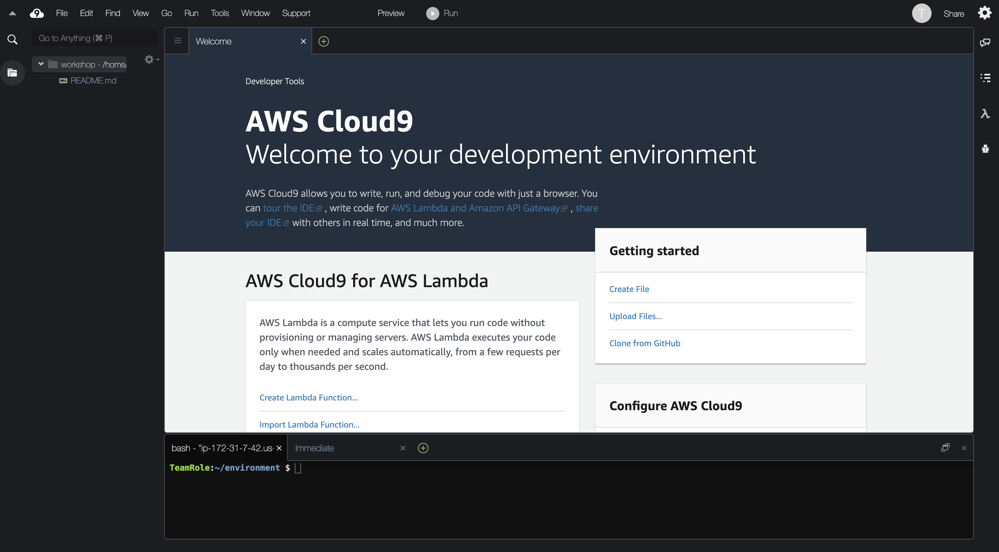

### 下载项目代码

打开一个新的Terminal. 
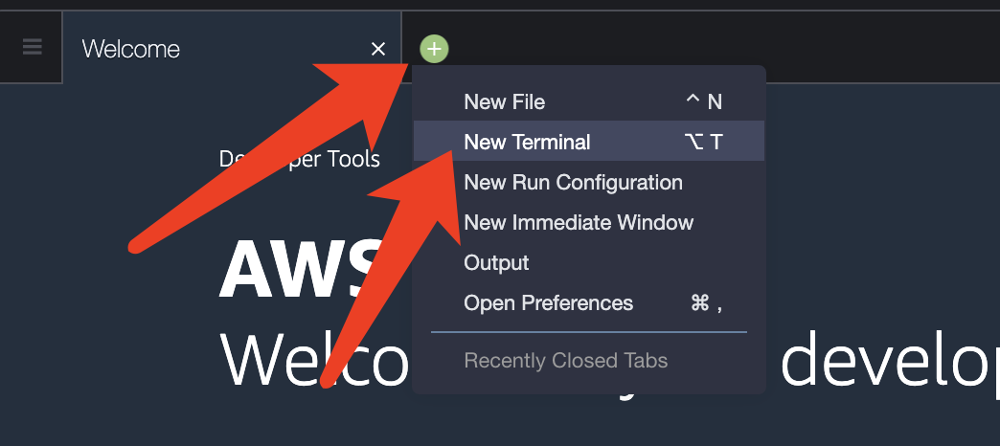

下载代码

```
git clone https://github.com/bnusunny/serverless-video-transcoder.git

cd serverless-video-transcoder/
```

### 部署项目

通过sam部署项目

```
sam build
```
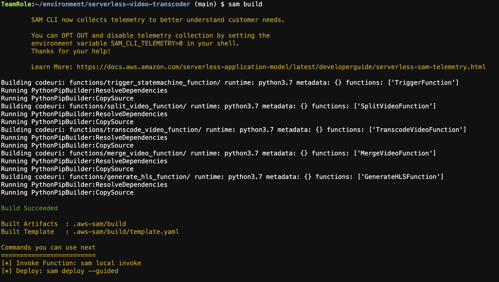

```
sam deploy --guided
```

修改下面的参数，其他参数保留默认值。
- "stack name"输入 serverless-video-transcoder
- "AWS Region"输入 us-west-2
- "VideosBucketName"输入 svt-<name>

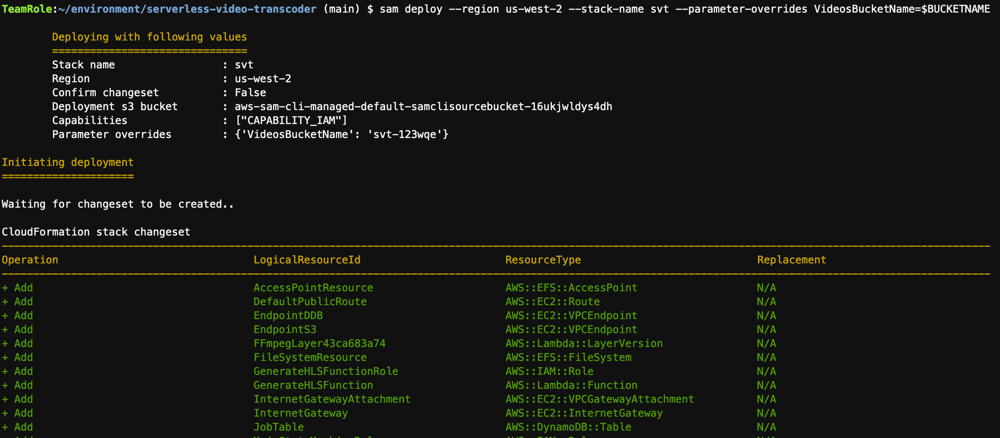

几分钟后，部署完成。
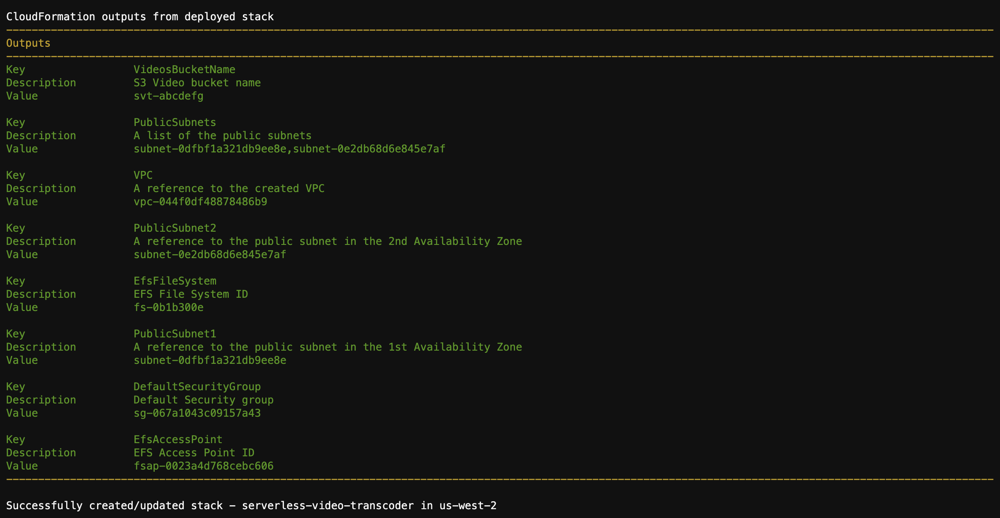

### 扩展EBS空间

Cloud9实例初始EBS卷容量较小，为10GB。运行下面的脚本，把EBS卷容量扩展为100GB。

```
quickstart/scripts/resize.sh 100

```
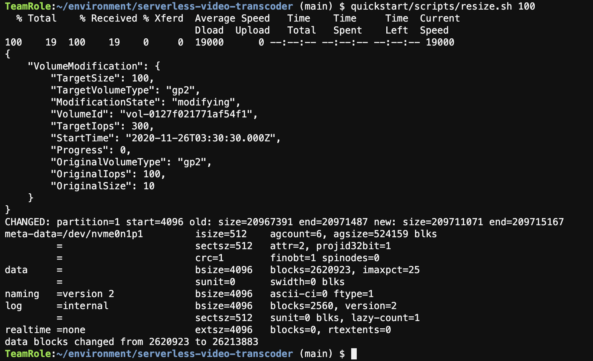

### 下载测试视频

运行下面的脚本，下载测试视频文件。 

```
quickstart/scripts/download-videos.sh
```
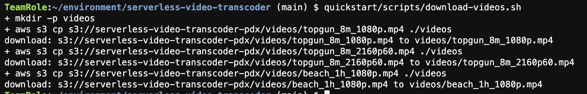


## 测试1：1080P 8分钟视频转码为720p

运行下面的命令来启动第一个测试。注意要将svt-<name>改成您设置的值。

```
aws s3 cp videos/topgun_8m_1080p.mp4 s3://svt-<name>/input/topgun01/
```
打开[Step Functions Console](https://us-west-2.console.aws.amazon.com/states/home?region=us-west-2#), 查看转码工作流运行状态。

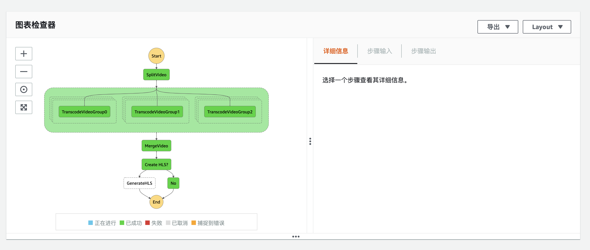

当转码工作流结束后，在S3 console中下载output目录中输出的视频. 播放视频，检查转码质量。 


第一个测试视频是时长8分钟的1080p视频，在1分钟左右完成转码。
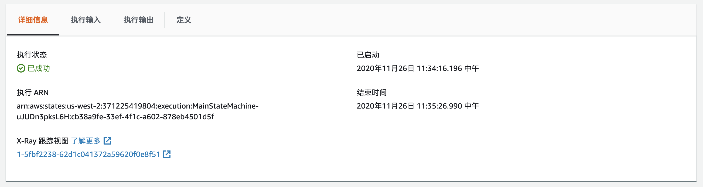

## 测试2: 1080p 1小时视频转码为720p

运行下面的命令来启动第二个测试。注意要将svt-<name>改成您设置的值。

```
aws s3 cp videos/beach_1h_1080p.mp4  s3://svt-<name>/input/beach01/
```
打开Step Functions Console, 查看转码工作流运行状态。

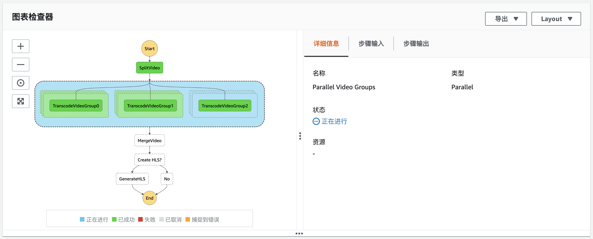

当转码工作流结束后，在S3 console中下载output目录中输出的视频. 播放视频，检查转码质量。 


第二个测试视频是时长60分钟的1080p视频，在4分钟左右完成转码。
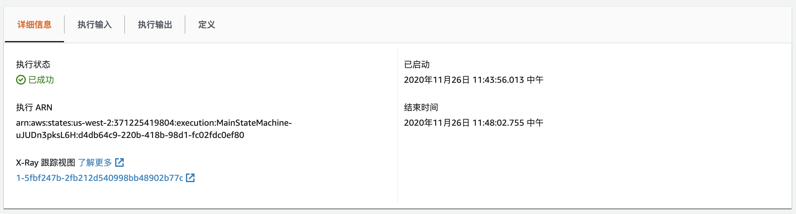


## 清理环境

删除S3存储桶“svt-<name>”中的所有视频，然后在[cloudformation](https://us-west-2.console.aws.amazon.com/cloudformation/home?region=us-west-2)中删除对应的stack。


